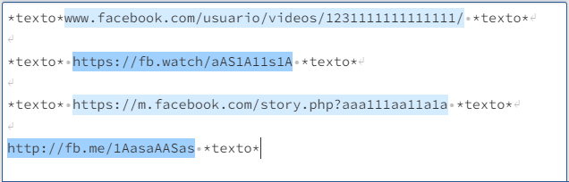

```{r, include=FALSE}
knitr::opts_chunk$set(echo=FALSE, 
                      error=FALSE,
                      warning=FALSE, 
                      message=FALSE)

library(tidyverse)

mensagens_enviada <-  c("https://www.facebook.com/facebookBrasil/videos/1083467282577703/")
```

```{r xaringan-themer, include=FALSE, warning=FALSE}
library(xaringanthemer)
style_mono_accent(
  base_color = "#1c5253",
  header_font_google = google_font("Josefin Sans"),
  text_font_google   = google_font("Montserrat", "300", "300i"),
  code_font_google   = google_font("Fira Mono")
)

# img {  
#     margin-left: 10%; 
# } 
```

class: center, middle

# Ecossistema de desinformação e propaganda computacional no aplicativo Telegram
### Uso da linguagem R para análise e visualização de dados sobre desinformação em grupos e canais do Telegram
<br />
#### .left[**Orientador: Leonardo Fernandes Nascimento**]
#### .left[**Nome: Beatriz Leal Fraga**]


---
## Sobre o projeto

<p align="justify"> O projeto propõe estabelecer uma estrutura de mapeamento e análises
multi-método de canais e grupos associados à extrema-direita encontrados no
aplicativo Telegram. Sua proposta combina análises computacionais e debates da sociologia e antropologia digitais.

<br >


--

#### **Ele é formado por 3 etapas:**

--

- <p align="justify"> A construção de uma estrutura ETL (Extraction, Transformation, Loading) para coleta, armazenamento e transformação de dados dos grupos e canais do Telegram.

--

- <p align="justify"> A utilização de linguagens como o R para a análise e visualização dos dados.

--

- <p align="justify"> Análise qualitativa do conteúdo das mensagens enviadas.

---

### <p align="justify"> O uso da linguagem R para análise e visualização de dados sobre desinformação em grupos e canais do Telegram

Esse estudo se caracterizou pela manipulação de dados qualitativos como mensagens de textos e pelo mapeamento de palavras-chaves. Nesse sentido, foram utilizadas técnicas de **análise descritiva e exploratória de dados**, **mineração textual** e **raspagem de dados**.

<br >

#### **Materiais utilizados:**

<br >


.pull-left[]

.pull-right[]

---

### **Ecossistema Multiplataforma**


<p align="justify"> O Telegram como ferramenta de organização e distribuição de conteúdo fraudulento para plataformas mais populares como Youtube, Instagram, Facebook, Twitter, Tiktok e Kwai.

<br>
```{r}
library(readxl)
library(kableExtra)
library(knitr)

plataformas <- read_excel("C:/Users/biial/OneDrive/Documentos/TabelaSlide.xlsx")

plataformas %>% 
  kable(align = "c", escape = F) %>% 
  row_spec(0, color = "white", background ="#1c5253") %>% 
  row_spec(1:7, bold = T, color = "black", background = "white") %>% 
  footnote("* Totalizando 751.530 links", 
  general_title = "")
```

---
### **Os problemas com a identificação de links**

#### .left[**As diferentes grafias:**]

.pull-left[
**Facebook:**
]

.pull-right[
*m.facebook.com/*

*facebook.com/*

*fb.watch/*

*fb.me/*
]

.pull-left[
**Instagram:**
]

.pull-right[
*instagram.com/*

*instagr.am/*
]

.pull-left[
**Youtube:**
]

.pull-right[
*youtube.com/*

*yotu.be/*
]


---
### Então, como fazer para identificar os links? `r emo::ji("scream")`

<p align="justify"> **1.** Análise exploratória com o intuito de reconhecer como esses links vão sendo encaminhados.

<br>

<p align="justify"> **2.** Utilização de Regex (Expressões Regulares) para extração desses links a partir das mensagens encaminhadas.
```{r, echo=T, results='hide'}
# str_stract(mensagem_enviada,
# "(?:https?:\\/\\/)?(?:www\\.)?(?:facebook|fb|m\\.facebook)\\.(?:com|me|watch|gg)\\/[a-zA-Z\\.\\d\\S]+")
```

```{r}

```
---
<br>
#### .left[**Os diferentes encurtadores:**]

<br>

.pull-left[
**Tiktok:**
]

.pull-right[
*vm.tiktok/aa11AA1a1A*

*vm.tiktok/bb22BB2b2B*
]

<br>
<br>

<p align="justify"> **3.** Requisições web para obter o domínio de origem.

```{r, echo=T, results='hide'}
 # Exemplo
 # httr::GET("http://vm.tiktok/encurtadorgenerico")
 # 
 # Resultado:
 # http://tiktok.com/@usuario/id-original
 # 
 # Usuários:
 # str_extract(link, "(?<=tiktok\\.com\\/)[@a-zA-Z0-9\\_\\.\\\\S]+")
 #
 # @usuario
```

---

<br> 

<br>

#### **Desse modo, foi possível: **

<br>

1. Apontar os links mais compartilhados;

2. Reconhecer, dentro do ecossistema mais amplo, os principais agentes responsáveis por pulverizar esses conteúdos para as mídias mais influentes;

3. Entender as narrativas que são construídas e os impactos de sua repercussão;

4. Fornecer insumos para discussão de temas que interessem as ciências sociais.


---

### Referências:

<br>

CESARINO, Letícia. **Pós-verdade e a crise do sistema de peritos: uma explicação cibernética.** Ilha Revista de Antropologia, v. 23, n. 1, p. 73-96, 2021.

HESS, David J. **The Sociology of Ignorance and Post‐Truth Politics**. In: Sociological Forum. 2020. p. 241-249.

MCGOEY, Linsey. **The unknowers: How strategic ignorance rules the world.** Bloomsbury Publishing, 2019.

SILGE, Julia; ROBINSON, David. **Text mining with R: A tidy approach.** " O'Reilly Media, Inc.", 2017.

DE AQUINO, Jakson Alves. **R para cientistas sociais.** 2014


---
class: center, middle

# Obrigada!

<!-- Slides created via the R packages: -->

<!-- [**xaringan**](https://github.com/yihui/xaringan)<br> -->
<!-- [gadenbuie/xaringanthemer](https://github.com/gadenbuie/xaringanthemer) -->


  <space>
<space> 